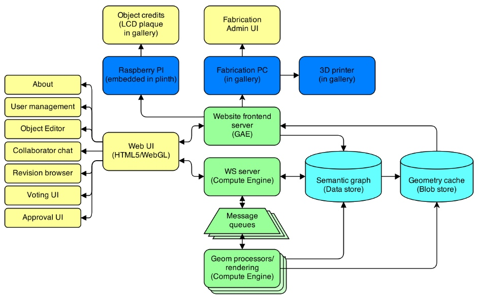

# System architecture and tools

Below is a diagram to give a better overview of the technical aspects of this project. Apart from key components like the use of GAE and various frontend elements, none of this is set in stone yet and am sure some parts are likely to change as I progress. But this is a good reference to understand (even for myself) what I'm working towards over the coming months.

Maybe I should also list some of the main tools & languages I'm using to build this all:

## Emacs & Org-mode

It took me more than two decades to overcome my fear of Emacs, but ever since spending more time in SSH sessions (and needing an unified environment) and also since digging ever deeper into the world of [Clojure](http://www.creativeapplications.net/tutorials/introduction-to-clojure-part-1/), I quickly came to appreciate its magic and haven't looked back. Muscle memory FTW! Together with the [Paredit](http://www.emacswiki.org/emacs/ParEdit) and [Org-mode](http://orgmode.org) add-ons and the latter's [literate programming](https://en.wikipedia.org/wiki/Literate_programming) [tools](http://orgmode.org/worg/org-contrib/babel/intro.html) I (re)discovered true joy in coding.

## Clojure

Speaking of [joy](http://joyofclojure.com/), [Clojure](http://clojure.org) has become my main weapon of choice over the past 3 years and this project too will be largely built in that language. It's not only its unique philosophy, but also its REPL and the language being designed as an hosted language, which makes it very valuable to me. Via its [ClojureScript](https://github.com/clojure/clojurescript) dialect & toolchain, I can re-use large amounts of code and compile into heavily optimized JavaScript (courtesy of [Google's Closure compiler](https://developers.google.com/closure/compiler/)). Since Clojure is running on the JVM, all App Engine parts will be built with Google's Java SDK for which I've already started creating nice wrappers to make the experience less verbose than in Java.

## Web stack: Ring, Compojure, Liberator & Hiccup

The Clojure community eschews monolithic frameworks (e.g. Rails, Spring) and instead seems to produce an unweildly number of tiny/small independent libraries, which (usually) can be composed at will. This is largely made possible by working with a dynamically typed language with immutable data and powerful data abstractions. For web related projects, most Clojure libraries are built on top of [Ring](https://github.com/ring-clojure/ring) and/or [Compojure](https://github.com/weavejester/compojure) which provide the low level foundations and are somewhat comparable to Ruby's [Rack](http://rack.github.io) and [Sinatra](http://sinatrarb.com). Sitting on top of both is [Liberator](https://github.com/clojure-liberator/liberator), a library for exposing REST API endpoints and implementing the full HTTP decision tree with various hooks for customization. [Hiccup](https://github.com/weavejester/hiccup) is a library to represent HTML as plain, nested Clojure data structures, allowing for super concise syntax and using normal Clojure functions to create templating functionality. [Hiccups](https://github.com/teropa/hiccups) is a ClojureScript port to gain this functionality also browser side. There's also the awesome [dommy](https://github.com/Prismatic/dommy) for similar purposes, based on Hiccup's approach as well.

## Angular.js vs. Om (React.js)

I've previously worked with [Angular](http://angularjs.org) and very much enjoyed it, though [David Nolen](http://) has been doing stellar work on his Om ClojureScript wrapper around [React]() which are very promising. So a final decision about which to use is still outstanding.

## Leiningen

As the defacto build tool for Clojure, I'm using [Leiningen](http://leiningen.org) dozens of times each day. It's not just providing amazingly easy to use dependency management, but also is hugely extensible via [plugins](https://github.com/technomancy/leiningen/wiki/Plugins) (e.g. for unit testing, linting, refactoring, distribution etc.) and truly is at the heart of my dev process.

## Speclj

I have to admit that I'm not belonging to the hardcore TDD camp, largely because working in the REPL allows me to build & examine code in a far more detailed & interactive manner than writing unit tests. However, there're situations where I do appreciate the piece of mind of having an extensive (never exhaustive!) suite of test cases and for those I started using [Speclj](http://speclj.com), which has a nice auto runner (a Leiningen plugin) and supports ClojureScript too.

## Toxiclibs & co

A large part of the code will deal with mesh generation, WebGL rendering and various other geometry related tasks. My own set of libraries will play the key role here.

## Blender

My relationship to Blender had been similar to the one I had with Emacs, largely thanks to its non-conforming UI. However, having jumped over my own laziness and taking on the learning curve, it's now my tool of choice for creating quick 3d mockups & sketches.

## LuxRender

[LuxRender](http://luxrender.net) is my favourite open source renderer and I'm currently investigating if/how I can utilize it within the proposed project setup.

## Meshlab

To paraphrase: "Everytime I hear the word 'mesh' I reach for my Browning", actually... "reach for my [Meshlab](http://meshlab.sf.net)" - it's a great 3D mesh viewer/processor with support for many file formats. Essential for my line of work...
