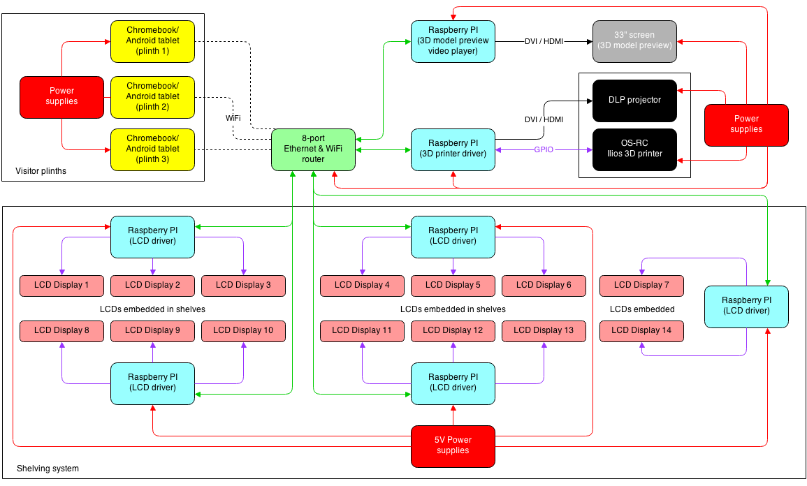

# Exhibit hardware plan

With the initial LCD badge experiments completed (see upcoming post), I've just created a top level hardware plan for the exhibit setup at the Barbican. I'm still waiting for new LCDs with an I2C interface, which should allow me to reduce the number of Raspberry PI's needed and bring costs down. However, I'm still not sure if I2C will be fast enough to ensure scrolling texts on all 14 LCDs, so I have to defer a decision until later. Similarly, I also haven't confirmed yet if driving the 3D printer will be possible from an RPi, but am fairly confident even though there might not be an existing solution, that I can write one myself.

