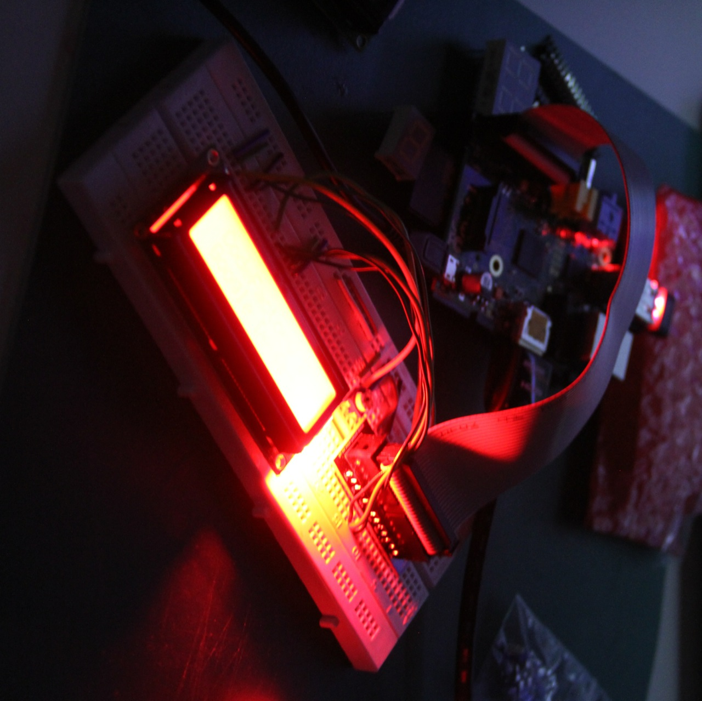

# Initial LCD badge experiments

As the [Barbican](http://barbican.org.uk) & [exhibition](http://fiftynineproductions.co.uk) [designers](http://abrogers.com) are already busily working on designing the physical side of the exhibition, I needed to specify the requirements for my piece and supply an hardware plan. Before I could create this though, some sense checking & experimentation was needed first, which this post is giving an overview of.

As illustrated in the hardware plan further below, my exhibit will involve a number of LCD badges (14 to be precise) acting as dynamic labeling system for the most recently fabricated objects in the gallery. Since the plan is to print a single object per day, we will end up with approx. 70 objects at the end of the show. These objects are exhibited in a shelving system spanning almost the entire height (6m) of The Curve gallery, with each layer of shelves holding 7 objects. At the end of each week all objects will be moved one layer up to free up space for the next week of production at the bottom layer. Since the higher layers will be above eye level, we decided to only label the objects of the past 14 days and for that I imagined to use small LCD displays. Each display will show credits and an URL for its associated object and the dynamic nature simplifies the re-shelving the objects: Once the physical re-shelving is completed each Sunday night/Monday AM, the Barbican staff can update the displays via the admin component of the web app/design tool without having to shuffle labels around too.

To keep the amount of required hardware as low as possible, I'm currently aiming to use [Raspberry PIs](http://raspberrypi.org) as display controllers. The RPi is great because it's providing a lot more of the features I need (i.e. Ethernet, SSH access, better software support) than an [Arduino](http://arduino.cc) based solution and in total is possibly turning out cheaper too. I've followed a couple of tutorials (see links below) to test drive two 16x2 LCDs with the RPi and am pretty happy with the results so far. Since I only had a couple of non-I2C enabled displays, my tests (and resulting exhibition specs) currently only make use of these, but I'll do further experiments once the new modules arrive, which should allow me drastically reduce the number of RPis needed to drive all 14 LCDs. The only thing am still skeptical about is general I2C communication speed on the RPi (only supports fast mode, up to 400kHz). Since the displays do not have enough characters to show a still unknown (and potentially longish) URL, support for scrolling text is a requirement and I will have to see how well I2C is holding up in allowing me to do this with that many displays at once.

Even though the colors of the LCDs are not very truthful in those images, I'm much preferring the red version so far, which really is *intensely* red and will also nicely tie in with the color of the acrylic enclosure around the 3d printer. I've yet to design how the displays will be embedded into the actual shelving and will collaborate with the design team on that. So far I also envisage that each LCD will be mounted on a small (likely custom made) PCB, which will have header sockets for the LCDs themselves (on the front) and header sockets on the back to allow daisy chaining modules. So this project also turns out to be a nice opportunity to get back into [Fritzing](http://fritzing.org), which I've been meaning to use more seriously for a long time (Hello Andre! :)

